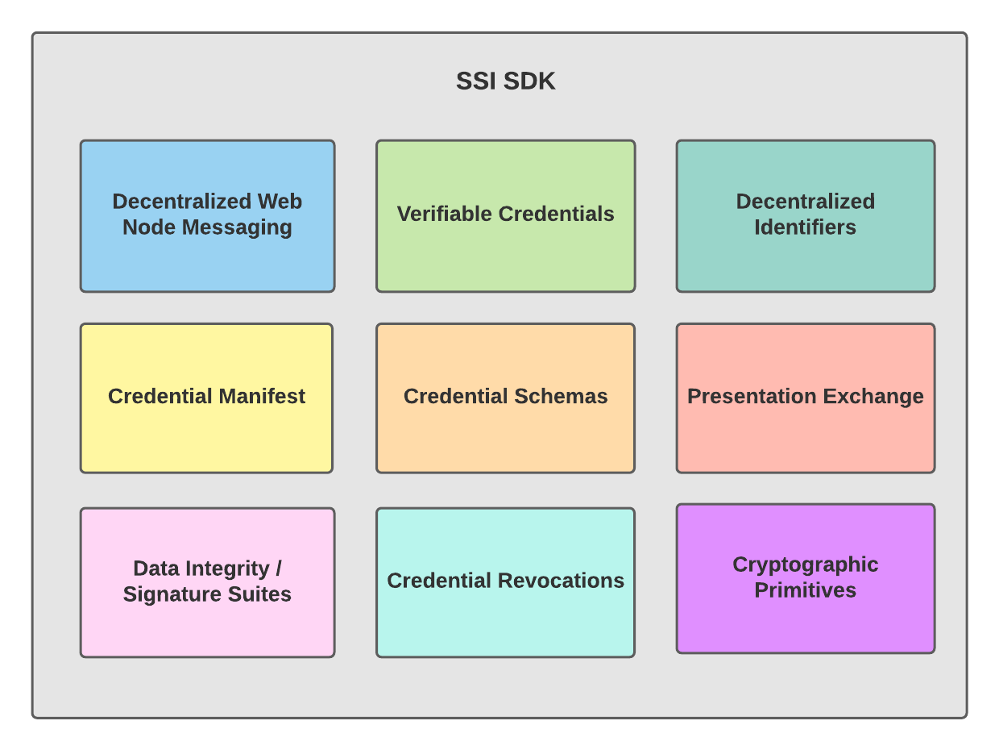

# ssi-sdk-wasm

# :warning: DEPRECATED :warning:

> :exclamation: **WARNING**: This repository is no longer maintained or updated. Use at your own risk!

---

[](https://www.npmjs.com/package/ssi-sdk-wasm)

`ssi-sdk-wasm` is a library that provides a WebAssembly (WASM) implementation for Self-Sovereign Identity (SSI) SDK. It enables SSI functionality in the browser and other JavaScript environments by compiling the SDK to a WASM file. This repository is responsible for building the `main.wasm` file and making it available as an npm package.

## Table of Contents

- [Usage](#usage)
- [Build](#build)
- [Test](#test)
- [Example](#example)
- [Concepts](#concepts)
- [Contributing](#contributing)
- [Specifications](#specifications)
- [Resources](#resources)


## Usage

To use the ssi-sdk-wasm package, simply import it in your project (Note this only works in nodejs currently, to use in react you can follow the example in the example directory):

```bash
import SSI from 'ssi-sdk-wasm';
```

## Build

To install the `ssi-sdk-wasm` package, run:

```bash
npm install
npm run build
```

This will produce create the wasm file from the generation code in the wasm directory the following output files:

* dist/index.js: Bundled JavaScript file
* dist/main.wasm: Compiled WASM file

The build script also copies the main.wasm file to the examples/react/public/ directory.

## Test

This contains a simple test to make sure all wasm functions are working properly

```bash
npm run test
```


## Example
There are examples in the example directory. This code snippet will create a did in your nodejs application
```javascript
import SSI from 'ssi-sdk-wasm'

async function run() {
    console.log(await SSI.makeDid());
}

run();
```

## Concepts
Named `ssi-sdk`, this SDK encapsulates a set of standards related
to [Self Sovereign Identity](http://www.lifewithalacrity.com/2016/04/the-path-to-self-soverereign-identity.html).
The `ssi-sdk` intends to provide flexible functionality based on a set of standards-based primitives for building
decentralized identity applications in a modular manner: with limited dependencies between components.



The image above outlines the SDK's vision. Standards may be added and/or removed. The standards themselves are under
active development, and as such, are subject to change. When possible we aim to call out which versions or revisions of
standards we are building implementations against.

The SDK has not undergone any formal security review or audit, so please use with caution.

For more information, see the [vision document](doc/VISION.md).

## Contributing

This project is fully open source, and we welcome contributions! For more information please see
[CONTRIBUTING](https://github.com/TBD54566975/ssi-sdk/blob/main/CONTRIBUTING.md). Our current thinking about the
development of the library is captured in
[GitHub Issues](https://github.com/TBD54566975/ssi-sdk/issues).

## Specifications

Here are a set of references to specifications that this library currently supports. It is a dynamic set that will
change as the library evolves.

- [Decentralized Identifiers (DIDs) v1.0](https://www.w3.org/TR/2021/PR-did-core-20210803/) _W3C Proposed Recommendation
  03 August 2021_
- [Verifiable Credentials Data Model v1.1](https://www.w3.org/TR/2021/REC-vc-data-model-20211109/) _W3C Recommendation
  09 November 2021_
    - Supports [Linked Data Proof](https://www.w3.org/TR/vc-data-model/#data-integrity-proofs) formats.
    - Supports [VC-JWT and VP-JWT](https://www.w3.org/TR/vc-data-model/#json-web-token) formats.
- [Verifiable Credentials JSON Schema Specification](https://w3c-ccg.github.io/vc-json-schemas/v2/index.html) _Draft
  Community Group Report, 21 September 2021_
- [Presentation Exchange 2.0.0](https://identity.foundation/presentation-exchange/) _Working Group Draft, March 2022_
- [Wallet Rendering](https://identity.foundation/wallet-rendering) _Strawman, June 2022_
- [Credential Manifest](https://identity.foundation/credential-manifest/) _Strawman, June 2022_
- [Status List 2021](https://w3c-ccg.github.io/vc-status-list-2021/) _Draft Community Group Report 04 April 2022_

### signature suites

- [Data Integrity 1.0](https://w3c-ccg.github.io/data-integrity-spec) _Draft Community Group Report_
- [Linked Data Cryptographic Suite Registry](https://w3c-ccg.github.io/ld-cryptosuite-registry/) _Draft Community Group
  Report 29 December 2020_
- [JSON Web Signature 2020](https://w3c-ccg.github.io/lds-jws2020) _Draft Community Group Report 09 February 2022_
    - [VC Proof Formats Test Suite, VC Data Model with JSON Web Signatures](https://identity.foundation/JWS-Test-Suite/)
      _Unofficial Draft 09 March 2022_
      This implementation's compliance with the JWS Test
      Suite [can be found here](https://identity.foundation/JWS-Test-Suite/#tbd).
    - Supports both JWT and Linked Data proof formats with [JOSE compliance](https://jose.readthedocs.io/en/latest/).

### did methods

- [The did:key Method v0.7](https://w3c-ccg.github.io/did-method-key/) _Unofficial Draft 14 February 2022_
- [The did:web Method](https://w3c-ccg.github.io/did-method-web/) _20 December 2021_
- [The did:peer Method](https://identity.foundation/peer-did-method-spec/) _W3C Document 12 October 2021_
- [The did:pkh Method](https://github.com/w3c-ccg/did-pkh/blob/main/did-pkh-method-draft.md) _Draft, 22 August 2022_


## Resources

| Resource                                                                               | Description                                                                   |
|----------------------------------------------------------------------------------------|-------------------------------------------------------------------------------|
| [VISION](https://github.com/TBD54566975/ssi-sdk/blob/main/doc/VISION.md)               | Outlines the project vision                                                   |
| [VERSIONING](https://github.com/TBD54566975/ssi-sdk/blob/main/doc/VERSIONING.md)       | Project versioning strategy                                                   |
| [CODE_OF_CONDUCT](https://github.com/TBD54566975/ssi-sdk/blob/main/CODE_OF_CONDUCT.md) | Expected behavior for project contributors, promoting a welcoming environment |
| [CONTRIBUTING](https://github.com/TBD54566975/ssi-sdk/blob/main/CONTRIBUTING.md)       | Developer guide to build, test, run, access CI, chat, discuss, file issues    |
| [GOVERNANCE](https://github.com/TBD54566975/ssi-sdk/blob/main/GOVERNANCE.md)           | Project governance                                                            |
| [LICENSE](https://github.com/TBD54566975/ssi-sdk/blob/main/LICENSE)                    | Apache License, Version 2.0                                                   |
